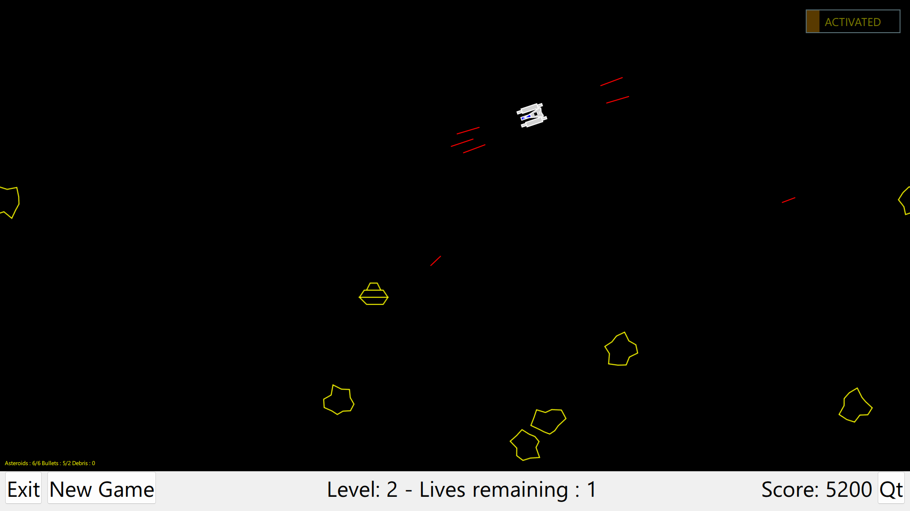
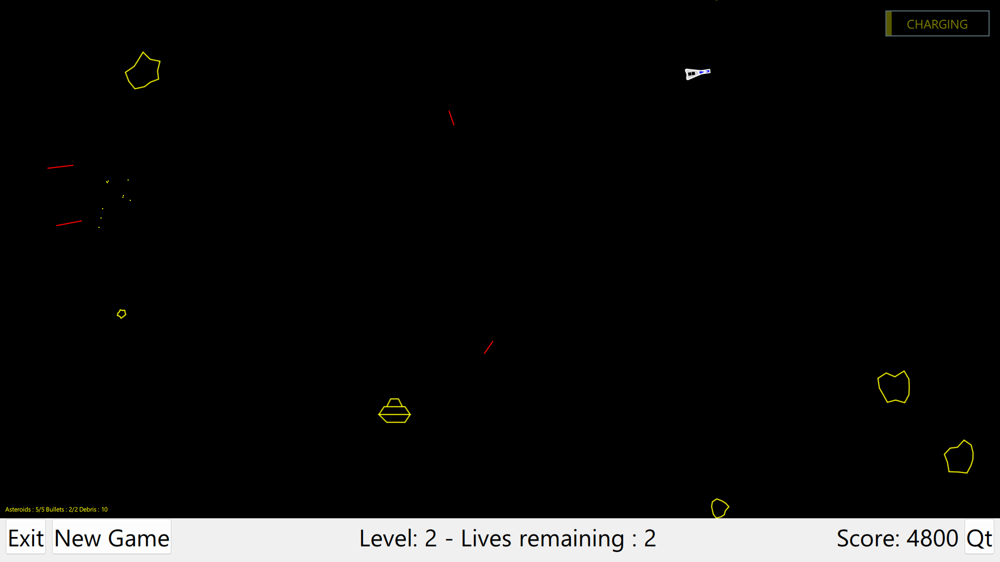

# AsteroidsCanvasQml

Asteroids retro game written solely for me (and you) to learn the QML (expecially the Canvas Item).

Currently I am learning Qt Quick / QML from the amazing Qt Company. 
I plan to add some better graphic and feature as my expertise grows. I have recently had fun adding some nice particle effects (-: 

Project is currently built against Qt 6.7 and Emscription SDK 3.1.50 and tested with Windows 11, Android Phone and of coarse WebAssembly (which is used in the Play Online link below).

Author: Neil Parker, Senior Software Developer

# Play Online
WASM singlethreaded (should work!)
- https://nepa1234software.github.io/AsteroidsCanvasQml-WebAssembly-SingleThreaded/appAsteroidsQml.html
- CODE - https://github.com/NePa1234Software/AsteroidsCanvasQml-WebAssembly-SingleThreaded

WASM multithreaded (TODO / Broken)
- https://nepa1234software.github.io/AsteroidsCanvasQml-WebAssembly/appAsteroidsQml.html
- CODE - https://github.com/NePa1234Software/AsteroidsCanvasQml-WebAssembly

# Qt
Qt is available either as a commercial or opensource license. I am using the opensource license and have thus also chosen the GPL licensing version for this code as well. 
I am not a QML expert, so do not expect the best code (yet !).

# QML / Qt Quick
QML is a descriptive language with a mix of JavaScript build on top of the Qt C++ Framework by the Qt company. 
-  https://doc.qt.io

The framework providing all you need to make a great looking applications. 
Here is an overview of all QML Item (control classes/widgets) and links to learning materials. There is a lot !!
- https://doc.qt.io/qt-6/qtquick-index.html
- https://doc.qt.io/qt-6/qmltypes.html

# Licensing
See the license file and License Folder for details
- The game is build using the Qt Framework opensource version (https://www.qt.io/licensing/)
- The vector battle font is provided from dafont (https://www.dafont.com/vector-battle.font)
- WebAssembly build powered by emscription SDK (https://emscripten.org/docs/introducing_emscripten/emscripten_license.html)

# Idea 
To learn something you need to read a lot - and more importantly you need to practice even more !!

I also learn through udemy courses and of course youtube and there are some great clips there. The official online QML Book is a great tutor.
I was inspired by javidx9. In his film it looks pretty easy to code asteroids (he did it in under an hour), but I know for sure that it took him a little longer to make the project and the great film !!!!
Thanks javidx9.
https://www.youtube.com/@javidx9
https://www.youtube.com/watch?v=QgDR8LrRZhk

# Screenshots

