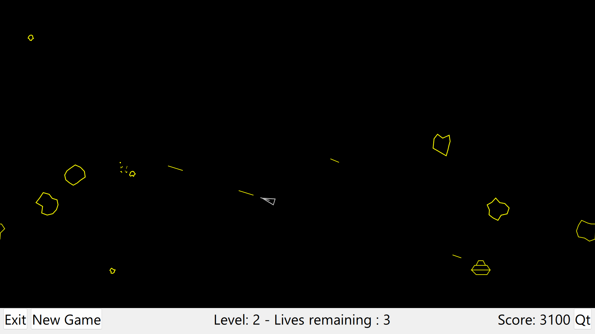
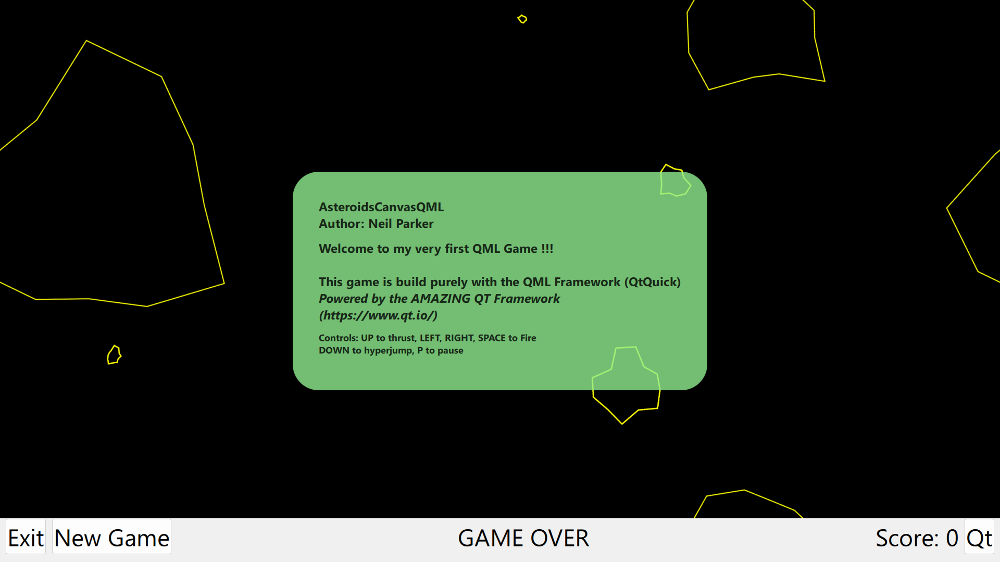

# AsteroidsCanvasQml

Asteroids retro game written solely for me (and you) to learn the QML (expecially the Canvas Item).

Currently I am learning QML (from the amazing Qt Framework). 
I plan to add some better graphic to practice more Canvas API. An installer or at least a portable deploy will come. 
When I learn other graphical modules I plan to clone this project to cleary differentiate the concepts.

Project was built against Qt 6.5. 

Author: Neil Parker

# Qt
Qt is available either as a commercial or opensource license. I am using the opensource license and have thus chosen the GPL version for this code as well. 
I am not a QML expert, so do not expect the best code (yet).

# QML
QML is a descriptive language build on top of the Qt C++ Framework, providing all you need to make a great looking applications.
Here is an overview of all QML Item and links to learning materials. There is a lot !!
- https://doc.qt.io/qt-6/qmltypes.html

# Idea 
To learn something you need to read a lot - and more importantly you need to practice even more !!

I also learn through udemy courses and of course youtube and there are some great clips there.
I was inspired by javidx9. In his film it looks pretty easy to code asteroids (he did it in under an hour), but I know for sure that it took him a little longer to make the project and the great film !!!!
Thanks javidx9.
https://www.youtube.com/@javidx9
https://www.youtube.com/watch?v=QgDR8LrRZhk

# Screenshots

