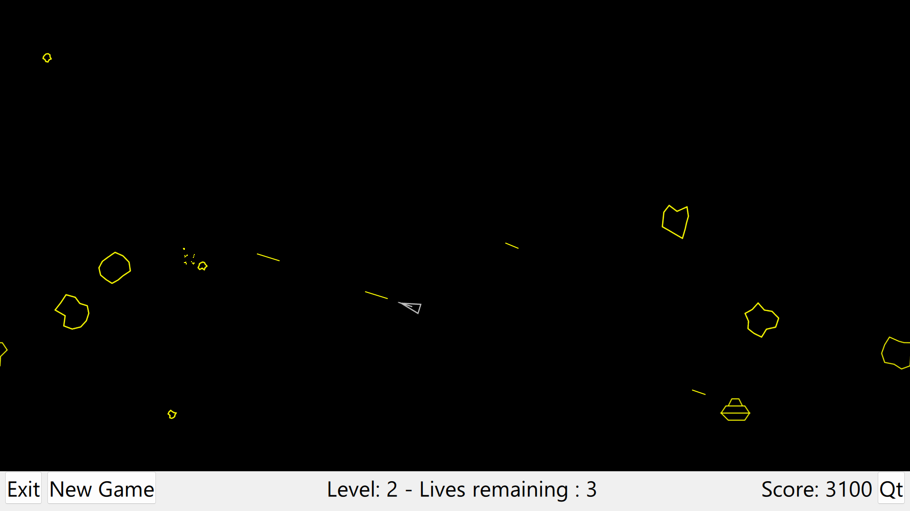
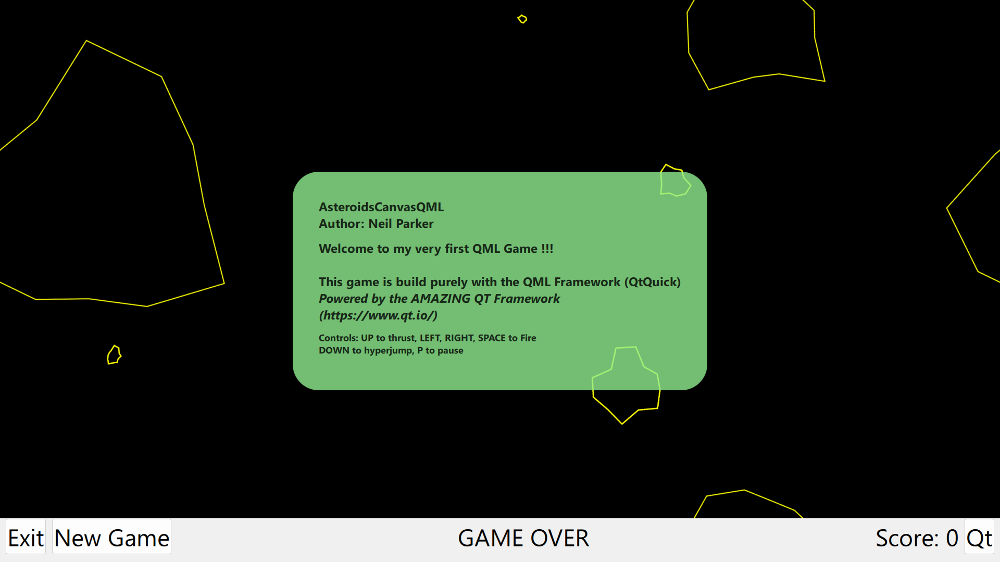

# AsteroidsCanvasQml
Asteroid retro game written solely to learn the QML Canvas Item. 
Currently I am learning QML (from the amazing Qt Framework). 
Author: Neil Parker

# Qt
Qt is either commercial or opensource. I am using the opensource version and have thus chosen the GPL version for this code. 
The game implementation is just made to learn the QML. Feel free to copy and do what you want with the code.
I am not an expert yet, so do not expect the best code (yet).

# QML
QML is a descriptive language build on top of the Qt C++ Framework, providing all you need to make a great looking application.
Here is an overview of all QML Item and links to learning materials. There is a lot !!
- https://doc.qt.io/qt-6/qmltypes.html

# Idea 
To learn something you need to read a lot - and more importantly you need to practice !!

I also learn through udemy courses and of coarse youtube and there are some great clips there.
I was inspired by javidx9. In his film it looks pretty easy, but I know for sure that it took him a little longer to make the project and the great film !!!!  
https://www.youtube.com/@javidx9
https://www.youtube.com/watch?v=QgDR8LrRZhk

# Screenshots

